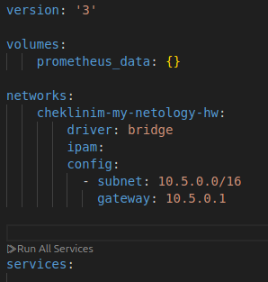
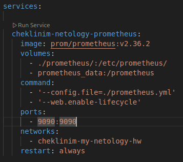
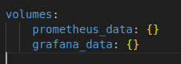
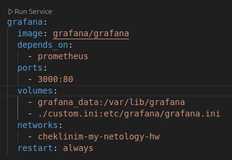
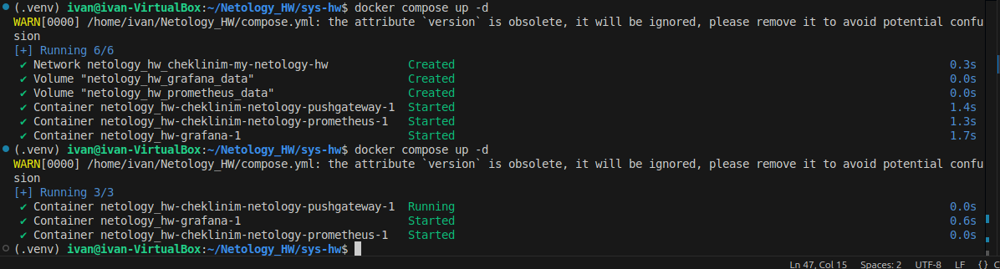
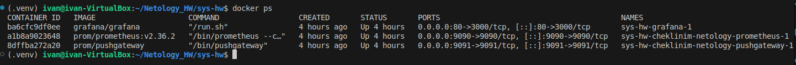
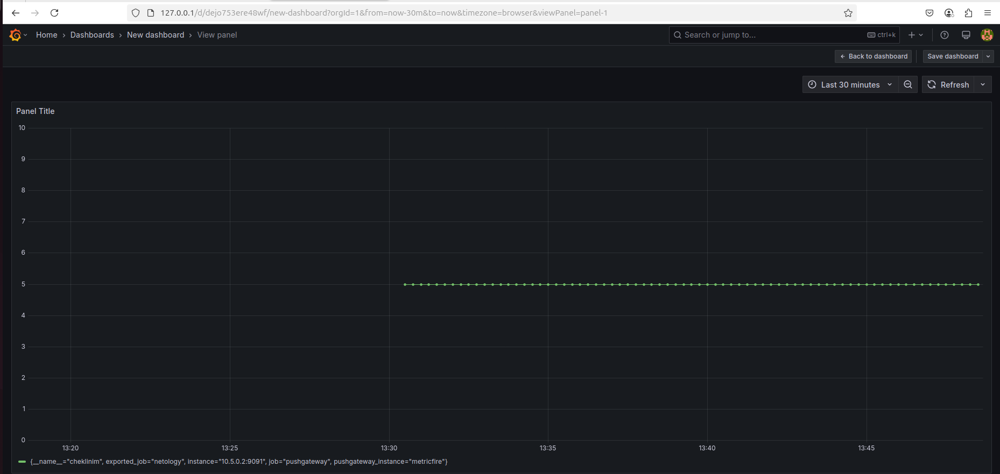
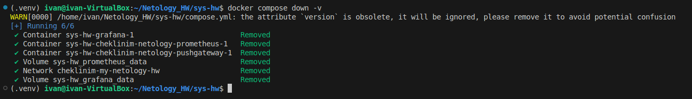

# Домашнее задание к занятию "`Docker. Часть 2`" - `Чеклиин Иван Михайлович`


### Инструкция по выполнению домашнего задания

   1. Сделайте `fork` данного репозитория к себе в Github и переименуйте его по названию или номеру занятия, например, https://github.com/имя-вашего-репозитория/git-hw или  https://github.com/имя-вашего-репозитория/7-1-ansible-hw).
   2. Выполните клонирование данного репозитория к себе на ПК с помощью команды `git clone`.
   3. Выполните домашнее задание и заполните у себя локально этот файл README.md:
      - впишите вверху название занятия и вашу фамилию и имя
      - в каждом задании добавьте решение в требуемом виде (текст/код/скриншоты/ссылка)
      - для корректного добавления скриншотов воспользуйтесь [инструкцией "Как вставить скриншот в шаблон с решением](https://github.com/netology-code/sys-pattern-homework/blob/main/screen-instruction.md)
      - при оформлении используйте возможности языка разметки md (коротко об этом можно посмотреть в [инструкции  по MarkDown](https://github.com/netology-code/sys-pattern-homework/blob/main/md-instruction.md))
   4. После завершения работы над домашним заданием сделайте коммит (`git commit -m "comment"`) и отправьте его на Github (`git push origin`);
   5. Для проверки домашнего задания преподавателем в личном кабинете прикрепите и отправьте ссылку на решение в виде md-файла в вашем Github.
   6. Любые вопросы по выполнению заданий спрашивайте в чате учебной группы и/или в разделе “Вопросы по заданию” в личном кабинете.
   
Желаем успехов в выполнении домашнего задания!
   
### Дополнительные материалы, которые могут быть полезны для выполнения задания

1. [Руководство по оформлению Markdown файлов](https://gist.github.com/Jekins/2bf2d0638163f1294637#Code)

---

### Задание 1

**Docker Compose** необходим в тех случаях, когда разворачиваемая система содержит в себе более одного контейнера. Также между этими контейнерами дожны быть настроены взаимосвязи. Соответственно при запуске каждого контейнера отдельно трудозатраты будут очень большими.

Используя **Docker Compose** можно описать все необходимые действия в одном конфигурационном файле (*compose.yml* или *docker-compose.yml*). После этого разворачивание всей системы будет выполняться автоматически, что очень удобно.

---

### Задание 2

`


---

### Задание 3

`

### Задание 4

`

### Задание 5

`
`

### Задание 6

Тут пришлось подправить некоторые значения в соответствии с выпавшими ошибками.
В итоге весь compose.ymlна данном этапе выглядит вот так:
```yaml
version: '3'

volumes:
    prometheus_data: {}
    grafana_data: {}

networks:
    cheklinim-my-netology-hw:
        driver: bridge
        ipam:
          config:
            - subnet: 10.5.0.0/16
              gateway: 10.5.0.1


services:

  cheklinim-netology-prometheus:
    image: prom/prometheus:v2.36.2
    volumes:
      - ./prometheus/:/etc/prometheus/
      - prometheus_data:/prometheus
    command:
      - '--config.file=./prometheus.yml'
      - '--web.enable-lifecycle'
    ports:
      - 9090:9090
    networks:
      - cheklinim-my-netology-hw
    restart: always
  
  cheklinim-netology-pushgateway:
    image: prom/pushgateway
    restart: always
    expose:
      - 9091
    ports:
      - "9091:9091"
    networks:
      - cheklinim-my-netology-hw
  
  grafana:
    image: grafana/grafana
    depends_on:
      - cheklinim-netology-prometheus
    ports:
      - 80:3000
    volumes:
      - grafana_data:/var/lib/grafana
      - ./sys-hw/custom.ini:/etc/grafana/grafana.ini
    networks:
      - cheklinim-my-netology-hw
    restart: always

```

`

### Задание 7

Система запущена


График метрики отображается в графане


#### Содержимое compose.yml:
```yaml
version: '3.7'

volumes:
    prometheus_data: {}
    grafana_data: {}

networks:
  cheklinim-my-netology-hw:
        name: cheklinim-my-netology-hw
        driver: bridge
        ipam:
          config:
            - subnet: 10.5.0.0/16
              gateway: 10.5.0.1

services:

  cheklinim-netology-prometheus:
    image: prom/prometheus:v2.36.2
    volumes:
      - ./prometheus/:/etc/prometheus/
      - prometheus_data:/prometheus
    command:
      - '--config.file=/etc/prometheus/prometheus.yml'
      - '--storage.tsdb.path=/prometheus'
      - '--web.console.libraries=/usr/share/prometheus/console_libraries'
      - '--web.console.templates=/usr/share/prometheus/consoles'
    ports:
      - 9090:9090
    links:
      - cheklinim-netology-pushgateway:cheklinim-netology-pushgateway
    depends_on:
      - cheklinim-netology-pushgateway
    networks:
      - cheklinim-my-netology-hw
    restart: always
#    deploy:
#      placement:
#        constraints:
#          - node.hostname == ${HOSTNAME}

  
  grafana:
    image: grafana/grafana
#    user: "472"
    depends_on:
      - cheklinim-netology-prometheus
    ports:
      - 80:3000
    volumes:
      - grafana_data:/var/lib/grafana
#      - ./grafana/provisioning/:/etc/grafana/provisioning/
      - ./custom.ini:/etc/grafana/grafana.ini
#    env_file:
#      - ./grafana/config.monitoring
    networks:
      - cheklinim-my-netology-hw
    restart: always

  cheklinim-netology-pushgateway:
    image: prom/pushgateway
    restart: always
    expose:
      - 9091
    ports:
      - "9091:9091"
    networks:
      - cheklinim-my-netology-hw

```

### Задание 8

Все очищено

